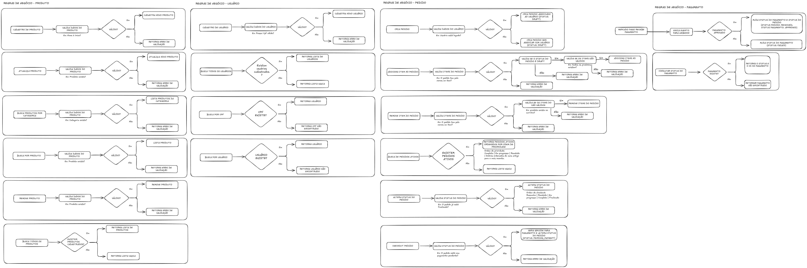
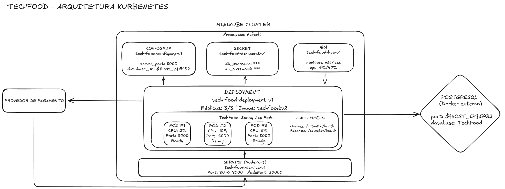

# TechChallenge

Este projeto consiste no desenvolvimento de um sistema de autoatendimento para uma lanchonete em expansão. O objetivo é de ser um sistema para gerenciamento de pedidos, gerenciamento de produtos e clientes, e acompanhamento do status dos pedidos tanto na parte administrativa, quanto na parte do cliente.

## Principais funcionalidades

- Cadastro e identificação de clientes.
- Gerenciamento de produtos e categorias (Lanche, Acompanhamento, Bebida, Sobremesa).
- Busca de produtos por categoria.
- Realização e acompanhamento de pedidos.
- Checkout (envio dos produtos escolhidos para a fila de pedidos).
- Listagem de pedidos.

## Tecnologias Utilizadas

### Aplicação
- Java 24: A linguagem base adotada para o desenvolvimento do projeto.
- Spring Framework: Framework para desenvolvimento de aplicações Java, oferecendo suporte a diversas funcionalidades.
- Spring Boot: Framework que simplifica a configuração e o desenvolvimento de aplicações Spring, permitindo uma inicialização rápida e fácil.
- Spring Data JPA: Biblioteca para integração com bancos de dados, facilitando o acesso e manipulação de dados.
- Swagger: Ferramenta para documentação de APIs REST, permitindo a visualização e testes das rotas disponíveis.
- Postgres: Banco de dados relacional utilizado para persistência de dados.
- Hibernate: ORM (Object-Relational Mapping) utilizado para mapear objetos Java para tabelas do banco de dados.

### Infraestrutura e DevOps
- AWS (Amazon Web Services): Plataforma de cloud computing utilizada para hospedagem da aplicação.
- Amazon EKS (Elastic Kubernetes Service): Serviço gerenciado de Kubernetes para orquestração de contêineres.
- Amazon ECR (Elastic Container Registry): Registro de imagens Docker.
- Amazon RDS (Relational Database Service): Banco de dados PostgreSQL gerenciado.
- Terraform: Ferramenta de Infrastructure as Code (IaC) para provisionamento da infraestrutura na AWS.
- Docker: Ferramenta para criação e gerenciamento de contêineres.
- GitHub Actions: Plataforma de CI/CD para automação de build, testes e deploy.

## Documentação

### Requisitos de négocio 

[link dos requisitos de négocio](https://excalidraw.com/#room=956182d839a6f9a2ee9c,TUlZhpNnWnFA-Q_HF-FuMw), caso a visualização esteja ruim.

### Arquitetura de infraestrutura

### Outros 
- [API Reference](docs/API-Reference.md)

## Arquitetura da Solução

A aplicação está hospedada na **AWS** com os seguintes componentes:

- **Amazon EKS**: Cluster Kubernetes gerenciado que orquestra os containers da aplicação
- **Amazon ECR**: Registry privado para armazenamento das imagens Docker
- **Amazon RDS**: Banco de dados PostgreSQL gerenciado
- **Load Balancer**: Distribui o tráfego entre os pods da aplicação
- **Auto Scaling**: Escala automaticamente os pods baseado em CPU/Memória (HPA)

A infraestrutura é provisionada via **Terraform** e o deploy é automatizado via **GitHub Actions**.

## Deploy Automatizado

### Configuração do GitHub Actions

A aplicação possui deploy automatizado via GitHub Actions. O workflow é acionado automaticamente a cada push na branch `main`.

#### Passos executados pelo workflow:

1. **Build da Aplicação**
   - Checkout do código
   - Configuração do JDK 24
   - Build com Maven (`mvnw clean package`)
   
2. **Build e Push da Imagem Docker**
   - Autenticação no AWS ECR
   - Build da imagem Docker
   - Push da imagem para o Amazon ECR
   
3. **Deploy no EKS**
   - Configuração das credenciais AWS
   - Atualização do kubeconfig para o cluster EKS
   - Deploy dos manifestos Kubernetes (namespace, configmap, secrets, deployment, service, hpa)

#### Variáveis de Ambiente

As seguintes variáveis estão configuradas no workflow:
- `AWS_REGION`: us-east-1
- `ECR_REPOSITORY`: techfood
- `EKS_CLUSTER_NAME`: eks-terraform-tech-food
- `IMAGE_TAG`: latest

### Configuração da Infraestrutura

A infraestrutura AWS é criada e gerenciada automaticamente via Terraform em um repositório separado. O Terraform realiza a criação dos seguintes recursos:
- Cluster EKS com nodes configurados
- RDS PostgreSQL
- ECR Registry
- VPC, Subnets, Security Groups
- IAM Roles e Policies

## Observações
- O projeto não inclui frontend, apenas backend.
- A aplicação escala automaticamente baseada na utilização de recursos (CPU/Memória).
- Para dúvidas ou problemas, consulte os integrantes da [organização](https://github.com/tech-pos-soat-architecture-fiap).
